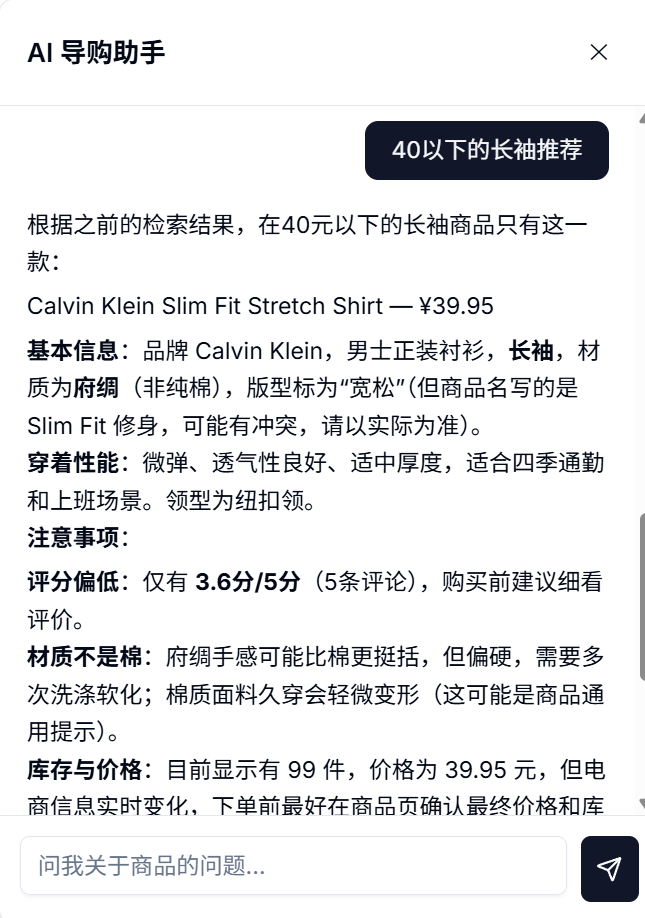
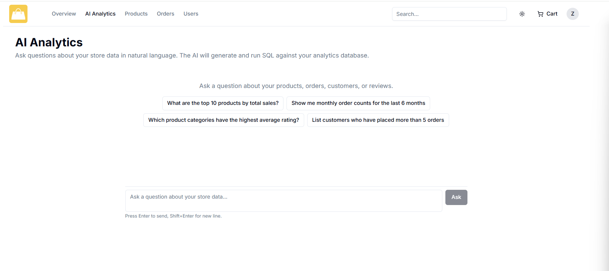
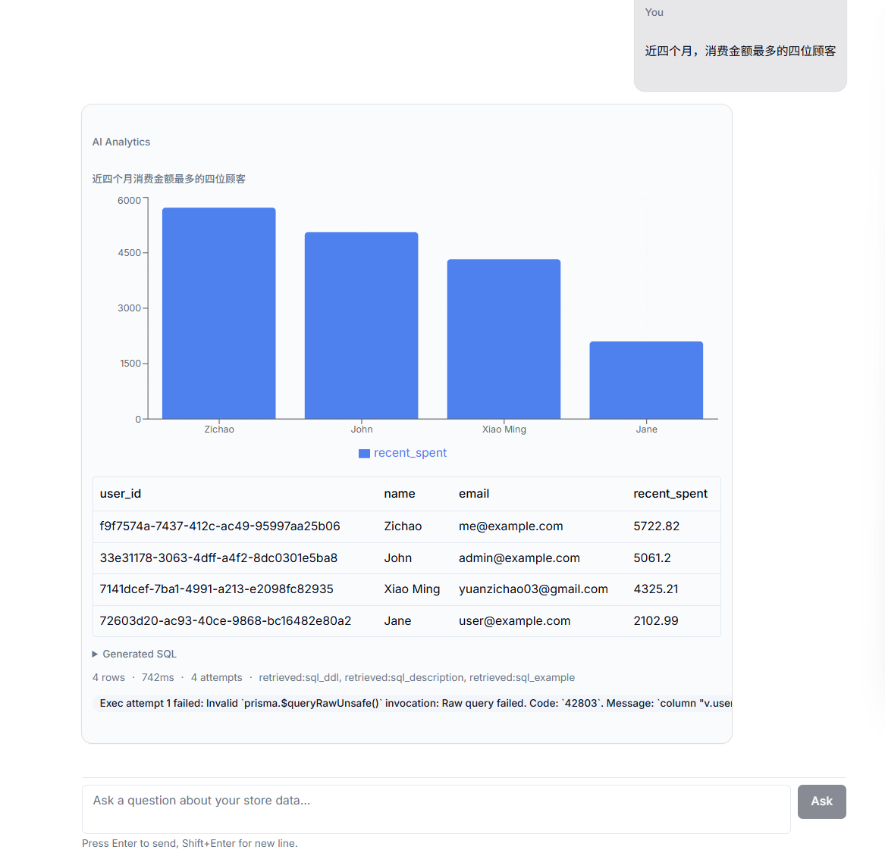

# Prostore — AI-Driven Full-Stack E-Commerce Platform

一个集成前台 AI 导购 RAG 与后台 Text2SQL 分析助手的 AI 驱动全栈电商平台，实现商品智能问答、精准推荐跳转、自然语言数据分析与可视化展示，并支持多角色权限、完整购物流程、双支付集成和后台管理等核心电商能力。

## Tech Stack

| Layer | Technology |
|-------|------------|
| Framework | Next.js 16 (App Router) + React 19 |
| Language | TypeScript |
| UI | shadcn/ui + Tailwind CSS v4 |
| Database | PostgreSQL + pgvector |
| ORM | Prisma |
| AI SDK | Vercel AI SDK + DeepSeek |
| Embedding | Alibaba Cloud DashScope (text-embedding-v4) |
| Auth | NextAuth v5 |
| Payment | PayPal + Stripe |
| Email | Resend + React Email |
| File Upload | UploadThing |
| Charts | Recharts |

## Highlights

### 商品页面展示

基于商品详情、评论与 FAQ 搭建混合 RAG 检索链路，结合意图路由、结构化过滤、FTS/向量召回与 RRF 融合优化问答准确率，并联动商品图片跳转提升导购转化效率。


**2.2  前台AI导购助手**




**2.3  后台 AI 分析助手 **

构建 Text2SQL RAG 链路，结合 DDL/字段说明/Few-shot 检索生成安全 SQL，并引入 AST 解析、视图白名单和只读执行约束控制查询风险，结合数据表格与 Recharts 图表生成，完成自然语言到业务分析结果的闭环。






## Getting Started

### Prerequisites

- **Node.js** ≥ 20
- **PostgreSQL** ≥ 14 with [pgvector](https://github.com/pgvector/pgvector) extension
- **npm** (or pnpm / yarn / bun)

### Installation

```bash
# Clone the repository
cd my-nextjs-app

# Install dependencies (automatically runs prisma generate)
npm install
```

### Environment Variables

Copy `.env.example` to `.env` and fill in the required values:

| Variable | Description |
|----------|-------------|
| `DATABASE_URL` | PostgreSQL connection string (must support pgvector) |
| `NEXTAUTH_SECRET` | NextAuth secret key |
| `NEXTAUTH_URL` | Application base URL (default: `http://localhost:3000`) |
| `OPENAI_API_KEY` | AI model API key (DeepSeek compatible) |
| `OPENAI_BASE_URL` | AI model base URL |
| `OPENAI_CHAT_MODEL` | Chat model name (e.g. `deepseek-v4-pro`) |
| `EMBEDDING_API_KEY` | Embedding API key (DashScope compatible) |
| `EMBEDDING_BASE_URL` | Embedding API base URL |
| `EMBEDDING_MODEL` | Embedding model name |
| `EMBEDDING_DIMENSIONS` | Embedding vector dimensions |
| `PAYPAL_CLIENT_ID` / `PAYPAL_APP_SECRET` | PayPal sandbox credentials |
| `NEXT_PUBLIC_STRIPE_PUBLISHABLE_KEY` / `STRIPE_SECRET_KEY` | Stripe test keys |
| `RESEND_API_KEY` | Resend email API key |
| `UPLOADTHING_TOKEN` | UploadThing token |

> **Note:** If `EMBEDDING_API_KEY` is not configured, RAG retrieval will automatically fall back to FTS-only mode.

### Database Setup

```bash
# Apply Prisma migrations
npx prisma migrate deploy

# Create vector indexes for hybrid search (FTS + vector)
psql $DATABASE_URL -f prisma/indexes.sql

# Create admin analytics views (for Text2SQL whitelist)
psql $DATABASE_URL -f prisma/views.sql
```

### Seed Knowledge Base (Optional)

The AI shopping guide and Text2SQL assistant rely on the knowledge base. Populate it with your product data, DDL documentation, and few-shot examples through the admin panel or seed scripts.

### Start Development Server

```bash
npm run dev
```

Open [http://localhost:3000](http://localhost:3000) in your browser.

### Build for Production

```bash
npm run build
npm start
```

## Project Structure

```
src/
├── app/                  # Next.js App Router pages & API routes
│   ├── (root)/           # Public-facing pages (home, products, cart, etc.)
│   ├── admin/            # Admin dashboard & AI analytics
│   └── api/              # API endpoints (chat, text2sql, RAG, payments)
├── components/           # Shared React components (shadcn/ui based)
├── lib/                  # Core business logic
│   ├── rag/              # RAG pipeline (embedding, retrieval, re-ranking)
│   ├── text2sql/         # Text2SQL generator, AST parser, SQL validator
│   └── payment/          # PayPal & Stripe integration
├── db/                   # Database queries & helpers
└── types/                # TypeScript type definitions
prisma/
├── schema.prisma         # Database schema
├── migrations/           # Database migrations
├── indexes.sql           # Vector & FTS indexes
└── views.sql             # Analytics views (Text2SQL whitelist)
```

## License

[MIT](LICENSE)
